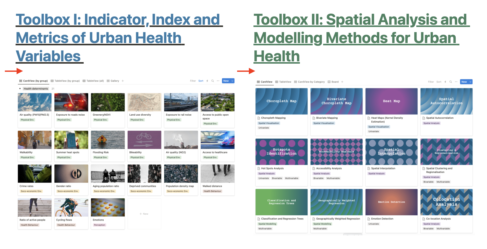
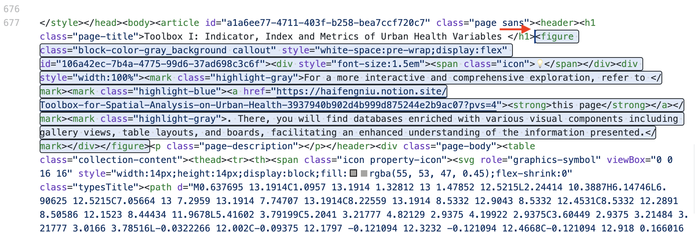

## Export from Notion

In notion home page, export as html without subfolder. Rename the html into index.html and copy the associated folder. Remove inline databases under the toolbox headings.

Enter subpage such as toolbox 1: export page as html with including subfolder. Rename folder it as toolbox1 and the html file as index.html. Back to the home index.html, replace the notion source for the toolbox by `toolbox1/index.html`. Do the same for toolbox2.

## Remove the database link from the home page

Remove the database link from the home page


## Add notion links (using callout) for both toolbox pages

Add this callout block in the index file for both toolbox1 and toolbox2.

```
<figure class="block-color-gray_background callout" style="white-space:pre-wrap;display:flex" id="106a42ec-7b4a-4775-99d6-37ad698c3c6f"><div style="font-size:1.5em"><span class="icon">💡</span></div><div style="width:100%"><mark class="highlight-gray">For a more interactive and comprehensive exploration, refer to </mark><mark class="highlight-blue"><a href="https://www.notion.so/haifengniu/a1a6ee774711403fb258bea7ccf720c7?v=1540ac99ce014231ad3e678caf7ba7da&pvs=4"><strong>this page</strong></a></mark><mark class="highlight-gray">. There, you will find databases enriched with various visual components including gallery views, table layouts, and boards, facilitating an enhanced understanding of the information presented.</mark></div></figure>
```



## Add Google Tag Manager
